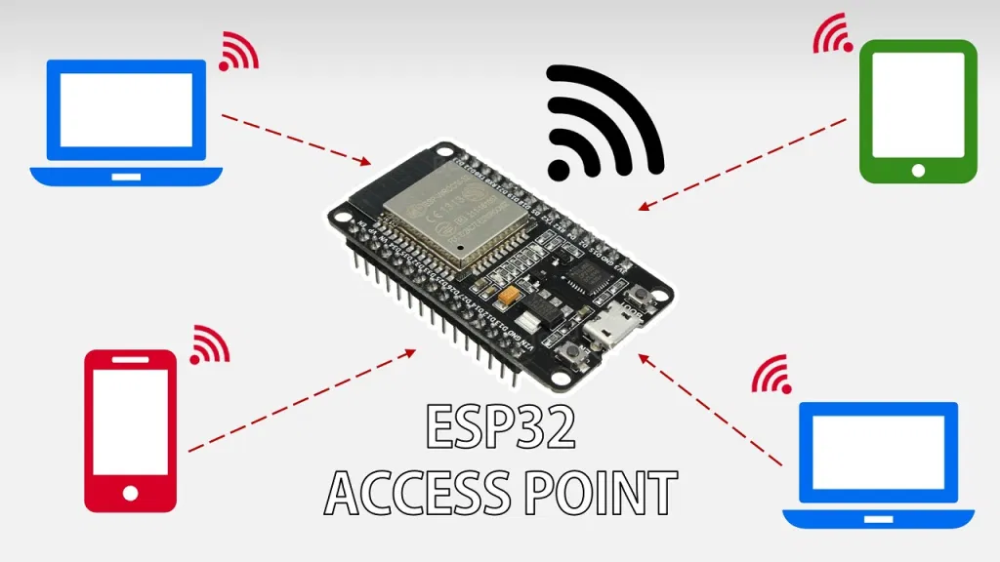
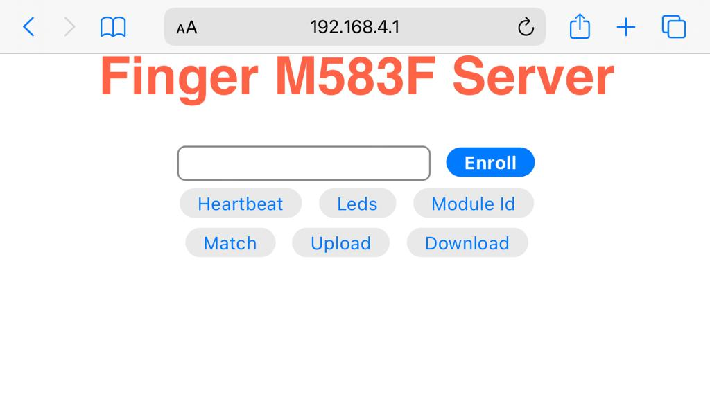

# About M583F Fingerprint Module

This capacitive fingerprint sensor M583F supports fingerprint capture, image processing, fingerprint storage, fingerprint comparison and so on and  is widely used and suitable for various fingerprint identification systems, such as:

* Fingerprint door locks, safes, gun boxes, finance and other security fields
* Access control system, industrial control computer, POS machine, driving school
training, attendance and other ide ntity fields;
* Private clubs, management software, licensing and other management fields

## About this Library and example

This software is based on documents received from the manufaturer [Guangzhou Gouku Technology Co., Ltd](https://gocool.en.alibaba.com/company_profile.html?spm=a2700.details.0.0.6c8b5b8emXWpxZ).

Documents received and extensivily referenced on methods are: 

* [Fingerprint product specification](assets/M583F-Gouku.pdf)
* [Fingerprit user's manual](assets/user's%20manual_Gouku.pdf)


This library contais a complete working project example for VSCode+ PlatformIO extension+ Arduino + ESP32 processor module

The ESP32 module acts as a Wi-Fi station access point :



Is uses a connected Browser to input commands:



## Table of Contents

- [About M583F Fingerprint Module](#about-m583f-fingerprint-module)
  - [About this Library and example](#about-this-library-and-example)
  - [Table of Contents](#table-of-contents)
  - [Hardware](#hardware)
  - [Installation](#installation)
  - [Libray Methods](#libray-methods)
  - [Credits](#credits)

## Hardware

On file platformio.ini is defined on what pins module M583F is connected to ESP32 module, change it according to your hardware circuit design:

build_flags =
    -D ENABLE_DEBUG_FINGER=1
    -D FINGER_PORT=0
    -D FINGER_VIN_GPIO=13
    -D FINGER_INT_GPIO=5

## Installation

This project is ready for running:

* Clone the project from GitHub
* Make the hardware connections
* Compile and upload software to module
* Open Plaformio serial monitor
* On configurations/Wi-Fi of your cell phone choose "FingerTests" network, password = "123456789"
* Open your cell phone brower on address 192.168.4.1 (may be another, check it on debug serial monitor screen)

## Libray Methods

Below are the higher level protocol methods implemented.
All module commands methods can be written just using these protocol methods.

There are many methods implementing module commands given as example that uses these methods such as:

* bool heartbeat();
* bool ledControl(uint8_t *params);
* bool moduleReset();
* bool autoEnroll();
* bool matchTemplate();
* void TxTemplate();
* void RxTemplate()

```C++

/// Command codes and extra data size
/// @see users manual Command set summary pages 9-12
Command AutoEnroll{cmd_fingerprint, fp_auto_enroll, 4};
Command HeartBeat{cmd_maintenance, maintenance_heart_beat, 0};
Command LedControl{cmd_system, sys_set_led, 5};
Command ReadId{cmd_maintenance, maintenance_read_id, 0};
Command MatchTemplate{cmd_fingerprint, fp_match_start, 0};
Command MatchResult{cmd_fingerprint, fp_match_result, 0};
Command FingerIsTouch{cmd_fingerprint, fp_query_slot_status, 0};
Command Enroll{cmd_fingerprint, fp_enroll_start, 1};
Command EnrollResult{cmd_fingerprint, fp_enroll_result, 1};
Command ModuleReset{cmd_system, sys_reset, 0};
Command SendTemplateStart{cmd_fingerprint, fp_start_send_template, 4};// @see users manual page 36
Command SendTemplateData{cmd_fingerprint, fp_send_template_data, 0x89}; //0x89 is the maximum to be sent at each packet
Command ReceiveTemplateStart{cmd_fingerprint, fp_start_get_template, 2}; // @see users manual page 38
Command ReceiveTemplateData{cmd_fingerprint, fp_get_template_data, 2}; 

/// @brief Sends Commands with no extra data, and receives response from module
// @see page Command set summary on pages 9 to 12 on users manual
/// @param command Only commands with fixed extra data bytes after header
/// @return if true, sets "dataBuffer" and "answerDataLength" according to received data
/// if false errorCode and  errorMessage are set
bool sendCommandReceiveResponse(Command command);


/// @brief Sends Commands with extra data, and receives response from module
// @see page Command set summary on pages 9 to 12 on users manual
/// @param command  Fix commands with variable extra data bytes after header(like 5.21 Fingerprint feature data download)
/// @param length number of extra bytes to send after
/// "dataBuffer" has to be filled with data( starting at index 6) to be sent 
///  first 6 bytes are added by protocol methods with check password (4)+ command(2) 
/// @return if true, sets "dataBuffer" and "answerDataLength" according to received data
/// if false "errorCode" and  "errorMessage" are set
bool sendCommandReceiveResponse(Command command,size_t length);
```

## Credits

Written by Roberto O Fonseca[roberto@ineltec.com.br]

Many lines of code came from "Elock_DemoCode" received from  [Guangzhou Gouku Technology Co., Ltd](http://www.zyjjhome.com/), and other free code examples for Arduino and ESP32.
